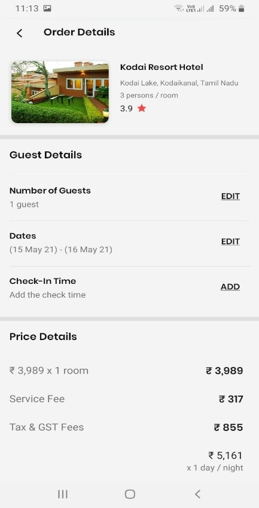

# TourBuddy-Travel-and-Tourism-
The TourBuddy is a Android Application that is based on Travel and Tourism Environment. The app provides the users with many user friendly features that able the users to views the app with ease. The app was created with the motive of making the people select their desire tourist place to visit in India in ease. The app is design and structured in such a way. The design are made to sooth the use of customer and it also make the user's experience better. Many user friendly features like UI/UX designs, favorites, booking hotels, analysis of places &amp; hotels, account settings, profile settings, dark mode, etc. The App also has the properties of download and saving the invoice of the booked hotels to the local device. TourBuddy is a progressing application so the application is still under improvement and enchancement. So, some essential of features are still to be implemented thta the users can see ASAP. Please explore the tourist places availbales via the application and also the hotels related to that places. As there are 400+ tourist places recorded in this application, the app also gives the users the feature to search their dsesired place. Please explore the application and express your true thoughts via feedbacks and comments so that we can recorrect those errors and improve our application. Thank You. 

Screenshots preview

